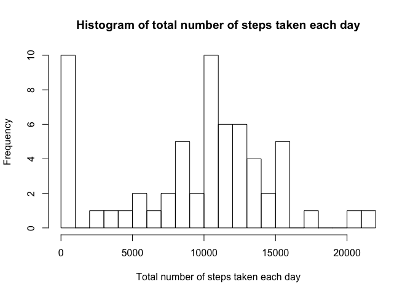
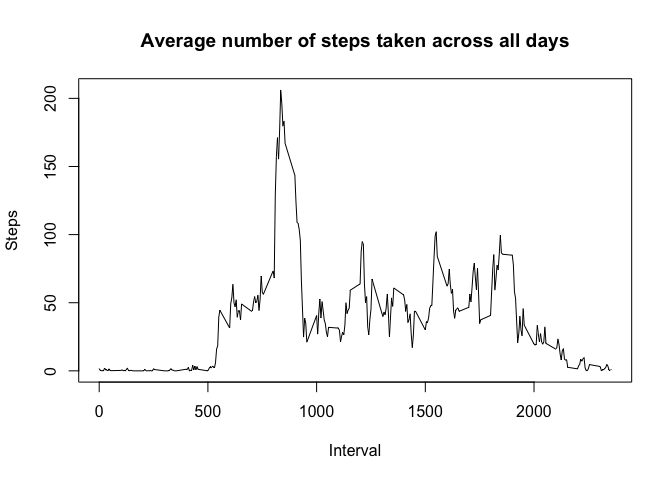
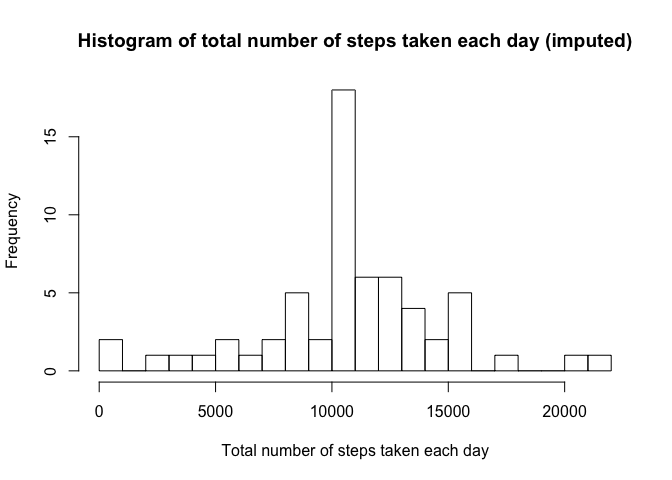

## Loading and preprocessing the data

```r
library(dplyr)
```

```
## 
## Attaching package: 'dplyr'
```

```
## The following objects are masked from 'package:stats':
## 
##     filter, lag
```

```
## The following objects are masked from 'package:base':
## 
##     intersect, setdiff, setequal, union
```

```r
XX <- read.csv("activity.csv", stringsAsFactors = F)
head(XX)
```

```
##   steps       date interval
## 1    NA 2012-10-01        0
## 2    NA 2012-10-01        5
## 3    NA 2012-10-01       10
## 4    NA 2012-10-01       15
## 5    NA 2012-10-01       20
## 6    NA 2012-10-01       25
```
  
### Transform date

```r
XX$date <- as.Date(XX$date, "%Y-%m-%d")
```
   
     
       

## What is mean total number of steps taken per day?

```r
XX.mean <- XX %>% group_by(date) %>% 
                  summarise(sum_steps = sum(steps, na.rm = T))

hist(XX.mean$sum_steps, breaks = 30, main = "Histogram of total number of steps taken each day", 
                                     xlab = "Total number of steps taken each day")
```

<!-- -->

```r
print(mean(XX.mean$sum_steps))
```

```
## [1] 9354.23
```

```r
print(median(XX.mean$sum_steps))
```

```
## [1] 10395
```
  
  
  
## What is the average daily activity pattern?

```r
XX.pattern <- XX %>% group_by(interval) %>% 
                     summarise(average_steps = mean(steps, na.rm = T))

plot(XX.pattern$interval, XX.pattern$average_steps, type = "l", 
     xlab = "Interval", 
     ylab = "Steps",
     main = "Average number of steps taken across all days")
```

<!-- -->
  
### The 5-minute interval that contains the max number of steps

```r
print(XX.pattern$interval[which(XX.pattern$average_steps == max(XX.pattern$average_steps))])
```

```
## [1] 835
```
  
  
  
## Imputing missing values, using the mean for that 5-minute interval

```r
nrow(XX[which(is.na(XX$steps)),])
```

```
## [1] 2304
```

```r
XX.imputed <- merge(XX, XX.pattern, by = "interval", all = T) %>%
              mutate(steps = ifelse(is.na(steps), average_steps, steps)) %>%
              select(-average_steps)

XX.imputed.mean <- XX.imputed %>% group_by(date) %>% 
                                  summarise(sum_steps = sum(steps, na.rm = T))

hist(XX.imputed.mean$sum_steps, breaks = 30, 
     main = "Histogram of total number of steps taken each day (imputed)", 
     xlab = "Total number of steps taken each day")
```

<!-- -->

```r
print(mean(XX.imputed.mean$sum_steps))
```

```
## [1] 10766.19
```

```r
print(median(XX.imputed.mean$sum_steps))
```

```
## [1] 10766.19
```
  
### The estimates are higher than non-imputed estimates from the first part of the assignment.  
  
  
  
## Are there differences in activity patterns between weekdays and weekends?

```r
XX.imputed <- XX.imputed %>% 
              mutate(weekday = weekdays(date)) %>%
              mutate(weekday_factor = as.factor(ifelse(weekday %in% c("Saturday", "Sunday"), "weekend", "weekday")))
               
XX.imputed.pattern <- XX.imputed %>% group_by(weekday_factor, interval) %>% 
                                     summarise(average_steps = mean(steps, na.rm = T))

library(lattice)
xyplot(average_steps ~ interval | weekday_factor, data = XX.imputed.pattern, 
       type = "l", layout = c(1, 2),
       xlab = "Interval",
       ylab = "Number of steps")
```

<!-- -->
